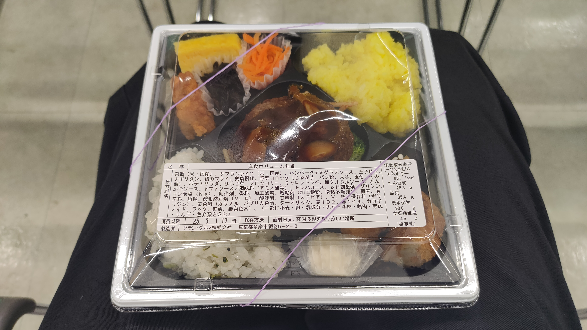
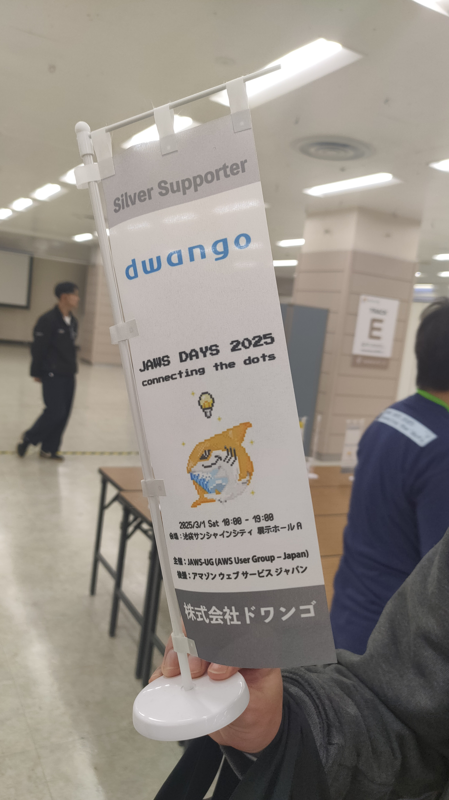

<!--
_class: lead
_paginate: false
-->

# JAWS DAYS 2025 Recap

クラウドサービス部
結城清太郎

---

# 概要

- 公式サイト: https://jawsdays2025.jaws-ug.jp/
- 開催日: 2025年3月1日(土)
- 会場: サンシャインシティ 展示ホールA
- テーマ: connecting the dots - 繋がりから生まれる新たなイノベーション
- JAWS DAYSの魅力
  - 最新技術動向や活用事例を学べる
  - 他のユーザーと交流できる
  - JAWS-UGメンバーが主体となって運営
  - AWSのスキルアップ、人脈形成、情報収集

---

# ギャラリー

---

<!--
_class: lead
_paginate: false
-->

# セッション紹介

---

<!--
_class: lead
_paginate: false
-->

# IAMのマニアックな話2025

---

# IAMのマニアックな話2025

- セッション: https://jawsdays2025.jaws-ug.jp/sessions/A-1
- スライド: https://speakerdeck.com/nrinetcom/iamnomaniatukunahua-2025
- 2019年に https://booth.pm/ja/items/1563844 という本を出した著者が今年新しい本を出すにあたって2019年からのIAM周りの変化を説明する

---

# IAMのマニアックな話2025

- **2019年からの変化**:
  - IAMユーザー中心から**IAM Identity Centerを活用しゼロへ** 
  - 明示的なポリシー定義から **動的制御（ABAC）+ 組織制御（SCP/RCP）** へ 
  - 定期監査から**リアルタイム監査（IAM Access Analyzer）+ AI提案**へ 
- **主要なアップデートと状況の変化**:
  - **IAM Access Analyzer**による問題設定の自動検出
  - **ABAC**（属性ベースアクセス制御）の一般化による柔軟な権限管理
  - **RCP**（リソースコントロールポリシー）による組織全体でのリソース制御
  - **AWS Verified Access**による動的なアクセス許可とゼロトラスト対応
  - **IAM Identity Center**とAWS Organizationsの統合強化

---

# IAMのマニアックな話2025

- **これからのベストプラクティス**:
  - **IAMユーザーは原則利用せず、IAM Identity Centerを活用** 
  - **ABACとSCP/RCPを組み合わせた多層的なポリシー設計** 
  - **IAM Access Analyzerによる継続的な監査と改善** 
  - **AWS Verified Accessなどを活用したゼロトラストアーキテクチャ** 
- **認証認可管理の課題**: IdP、IAM Identity Center、各アカウントのIAMロールの管理主体の連携 
- **今後のトレンド予想**:
  - ゼロトラストIAMへの移行とAWS Verified Accessの統合 
  - AIによるポリシー推奨・自動生成 
  - 動的なIAM管理の標準化とアクセス管理の自動化 

---

<!--
_class: lead small-title1
_paginate: false
-->

# AWSアカウントのセキュリティ自動化、どこまで進める？ 最適な設計と実践ポイント

---

<!--
_class: small-title2
-->

# AWSアカウントのセキュリティ自動化、どこまで進める？

- セッション: https://jawsdays2025.jaws-ug.jp/sessions/C-4
- スライド: https://speakerdeck.com/yuobayashi/awsakauntonosekiyuriteizi-dong-hua-dokomadejin-meru-zui-shi-nashe-ji-toshi-jian-pointo

---

<!-- _class: small-text -->

# FW系リソースの自動更新

- **自動化の目的**: 限られたリソースの効率的な活用、人的リソースを複雑なタスクへ配置、ガバナンス強化
- **自動化パターン例**
  1. **AWSサービスのみで作成する完全自動化**: WAFログをS3に出力、EventBridgeでStep Functions起動、IPアドレスをIPSetsに追加
     - メリット: **人的介入なしにIPSetsを更新可能**
     - 考慮点: 意図しないIPアドレス追加リスク
  2. **チャットツール起点とした自動化**: チャットボット経由でLambda関数を起動しFWリソースを更新
     - 例: Slackワークフローによる申請・承認フロー
     - メリット: 容易な承認フロー追加、運用効率化
     - 考慮点: 入力フォーム改修頻度、誤承認リスク、チャットツール障害時の代替手段
  3. **AWSサービスのみで作成する自動化**: S3バケットにアップロードされたファイルをトリガーにStep Functionsを起動して更新
     - メリット: 最も汎用的、誤操作リスク低減、社内規定に左右されにくい
     - デメリット: チャットツール連携より俊敏性劣る
- **組織への展開**: Firewall Managerを活用し、タグを用いた管理で柔軟性と統制を強化

---

<!-- _class: small-text -->

# アカウントのセキュリティ自動化

### GuardDuty Malware Protection for S3 の自動化
- **課題**：マルウェア検出後の隔離・削除、Security Hubへの集約がされない
- **対策**：Lambda関数で検出ファイルの隔離・削除、Security Hubへ検出結果をインポート

### Configを活用した自動修復
- 非準拠リソースをLambdaで自動修復 
- **ポイント**：修復対象をタグで制御、Security Hubのタグ付け標準活用、Configの記録頻度設定 
- **記録頻度**：「継続的な記録」「日次記録」「ハイブリッド」 
- **コスト管理**：予算作成、コスト分析、メトリクス分析 

### 自動化のポイント 
- **クリティカルな作業は自動化しすぎない**、代替手段を残す 
- まずは**小さいところから自動化**を進める 
- **ガバナンス強化とコストのバランス調整**が重要

---

<!--
_class: lead small-title1
_paginate: false
-->

# AWSではじめるWeb APIテスト実践ガイド：品質とセキュリティを支えるためのポイント

---

<!--
_class: small-title2
-->

# AWSではじめるWeb APIテスト実践ガイド

- セッション: https://jawsdays2025.jaws-ug.jp/sessions/A-6
- スライド: https://speakerdeck.com/yokawasa/a-practical-guide-to-testing-web-apis-on-aws
- 本セッションでは、AWSでのWeb APIテストの指針となる内容として、以下の2点を紹介しています:
  - **Web APIの品質、信頼性、セキュリティを担保するためのチェックポイント**
  - **AWSにおけるWeb APIの効果的なテスト、注意点、信頼性向上のためのアプローチ**

---

<!--
_class: small-title2 small-text
-->

# Web APIテストの主要チェック項目 品質・信頼性

- **機能要件**: APIがコントラクト通りの仕様で実装され、期待通りの振る舞いであるかを確認します。
    - **APIコントラクトテスト**: リクエスト・レスポンスのスキーマ整合性、型と値、必須パラメータなどを検証。APIドリフト問題への対策も重要です。
    - **CRUD操作の一貫性・冪等性**: 複数回の同じリクエストで結果が変わらないことを確認。
    - **APIバージョンの独立性・互換性**: 各バージョンが互いに影響せず、既存クライアントに影響を与えないかを確認。
    - **エラーハンドリング**: 不正リクエストや異常な入力に対してコントラクト通りのエラーレスポンスが返却されるかを確認。
    - **ネガティブテスト**: 異常系やエッジケースのテストも重要。不正なデータ型や形式、無効なトークンなどをテストします。
- **パフォーマンス**: 高負荷時の性能、長期安定性、スケーラビリティ、リソース効率などをチェック。レイテンシ、スループット、エラーレートなどのメトリクスを計測します。

---

<!--
_class: small-title2 small-text
-->

# Web APIテストの主要チェック項目 セキュリティ
- **認証・認可設定**: ユーザーが「誰であるか」を確認する認証と、「何を許可されているか」を決定する認可が適切に実装されているかを確認。特に認可制御は攻撃リスクが高いです。
- **無制限のリソース消費**: APIリクエストに伴うリソース消費が制限されているか、レート制限やスロットリングの設定を確認。
- **データの漏洩 / 過剰なデータ露出防止**: クエリ文字列、URLパス、APIレスポンス、エラーメッセージに機密情報が含まれていないかを確認。
- **入力データのバリデーション**: インジェクションやXSSを防ぐためのバリデーションが適切に行われているかを確認。
- **HTTPヘッダーのセキュリティ設定**: CORS、Cache-Control、Content-Type、HSTS、X-Content-Type-Options、X-Frame-Optionsなどの推奨セキュリティヘッダーが正しく機能しているかを確認。
- **OWASP API Security Top 10 2023** を意識した対策。

---

<!--
_class: small-title2 small-text
-->

# AWS環境でのAPI信頼性向上

- **API Gatewayの活用**: リクエストバリデーション、OpenAPIインポート・エクスポート、レート制限とスロットリング、認証・認可機能、WAFとの統合、データ保護（TLS/HTTPS）、モニタリング・ロギングなどの機能でAPIの信頼性を高めます。
- **セキュリティ対策の多層的アプローチ**: 通信の暗号化、適切な認証・認可設定、アクセス制御、プライベートAPIの利用、AWS WAFによる保護などを組み合わせてセキュリティを強化します。
- **パフォーマンス計測と監視**: CloudWatchでレイテンシ、エラー、スロットリングなどのメトリクスを監視し、X-Rayでレイテンシ分析を行います。
- **AWS環境特有の特性・制約の理解**: オートスケーリング、Lambdaやサーバーレス環境の特性、API Gateway/ALBの制限、ネットワーク関連、データストアの特性、CloudFront/CDNの特性などを考慮したテストと対策が必要です。
- **シフトレフトを心がけ、APIライフサイクル全体にわたりテストを実施し、継続的にテストケースをアップデートすることが重要**です。

---

<!--
_class: lead small-title1
_paginate: false
-->

# "TEAM"を導入したら最高のエンジニア"Team"を実現できた

---

<!--
_class: small-title2
-->

# "TEAM"を導入したら最高のエンジニア"Team"を実現できた

- セッション: https://jawsdays2025.jaws-ug.jp/sessions/A-10
- スライド: https://speakerdeck.com/yuj1osm/deploying-team-and-building-the-best-engineering-team

---

<!--
_class: small-title2
-->

# AWS基盤におけるアクセス管理の変遷と課題

## シングルアカウント構成の課題

- **権限管理が複雑化し、セキュリティ確保が困難**
- ワークロードごとのコスト把握が困難
- オペミスやクォータ値に引っかかりやすく運用が困難

## マルチアカウント構成とJumpアカウント方式

- **権限を分離しセキュリティを向上**
- ワークロードごとのコスト把握が容易
- 作業の影響を最小限に抑制し運用を効率化
- JumpアカウントにIAMユーザを集約し、各アカウントへスイッチロール

---

<!--
_class: small-title2
-->

# AWS基盤におけるアクセス管理の変遷と課題

## 初期の本番アクセス統制：「Jumpアカウント × Change Manager」

- Change Managerによる申請・承認ワークフロー
- 本番アクセス用グループを作成し、Change Managerの承認で一時的に追加
- **当時はAWS SSO (現 AWS IAM Identity Center) の仕様によりJumpアカウント方式を採用**

## 初期構成の課題

- 利用者目線：スイッチロールの入力が面倒、Change Manager申請までの導線が長い
- 管理者目線：IAMの管理負荷が高い、Change Managerのテンプレート管理負荷が高い

---

<!--
_class: small-title2
-->

# 「TEAM」による本番アクセス管理の実現と効果

## 「TEAM」とは？

- **Temporary Elevated Access Management の略称**
- IAM Identity Center のアクセスポータルから利用するアプリケーションとして提供
- **AWSアカウントへのアクセスを管理するための承認ベースのワークフロー**
- IAM Identity Center が必須

---

<!--
_class: small-title2
-->

# 「TEAM」による本番アクセス管理の実現と効果

## 「TEAM」による本番アクセス統制の流れ

1.  IAM Identity Center のアクセスポータルにアクセス
2.  TEAMアプリケーションにアクセス
3.  リクエスト申請（アカウントとロールを入力）
4.  承認者がリクエストを承認
5.  Step Function で許可セットを追加
6.  承認された権限でスイッチロール
7.  CloudTrail でロギング
8.  Step Function で許可セット削除

---

<!--
_class: small-title2 small-text
-->

# 「TEAM」による本番アクセス管理の実現と効果

## 「TEAM」導入の効果 

- **利用者目線：各アカウントへのスイッチロールが簡単に、申請への導線が短くシンプルで分かりやすいUI**
- **管理者目線：IAMの管理から解放、ペルソナの割り当てや申請ルールなどの設定管理が簡単に**
- **Team 全員が運用とセキュリティの意識が向上**
- **開発効率 UP、運用効率 UP**

## まとめ 

- マルチアカウント構成では本番アカウントへのアクセス管理が重要
- 「Jumpアカウント × Change Manager」でも制御可能だが、UXが低く管理負荷が高い
- **「IAM Identity Center × TEAM」で手軽に制御可能、UXが高く管理工数も低い**
- **「TEAM」の導入で Team の生産性とセキュリティ・コンプライアンスが向上**
